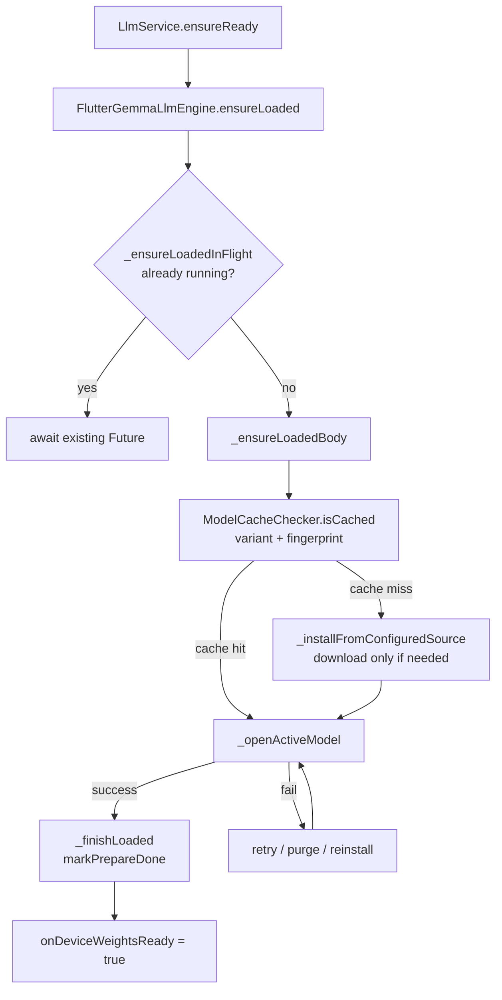

# Design Document: Model Download Cache

## Overview

The model download and cache flow governs how the learner app acquires and opens the on-device Gemma 4 weights (~2.4–4.4 GB). The current flow calls `_installFromConfiguredSource` unconditionally inside `ensureLoaded`, which delegates to `GemmaHfModelDownloadService.downloadModel`. That service does check `isPluginModelInstalled` internally, but the check is buried inside the download path and the result is only used to emit a log message — the download call still proceeds. The result is unnecessary I/O on every warm-up and a confusing code path.

This design introduces a clear **cache-first gate** at the top of `ensureLoaded`, makes the fast path explicit and testable, and adds a `ModelCacheChecker` helper that centralises the "is the model already here?" question so it can be unit-tested without touching the network or native channels.

---

## Architecture



The key change is the `ModelCacheChecker.isCached` gate (step F). When it returns `true`, the engine jumps straight to `_openActiveModel` — no download, no HEAD request, no progress callbacks for install.

---

## Components and Interfaces

### ModelCacheChecker (new)

A thin, stateless helper that answers "is the model for this variant already on disk and consistent with the active fingerprint?"

```dart
abstract final class ModelCacheChecker {
  /// Returns true when:
  ///   1. The model file exists on disk (non-zero length).
  ///   2. ModelPreparePrefs reports done with a fingerprint matching [variant].
  ///
  /// Pure local I/O — no network calls.
  static Future<bool> isCached(Gemma4OnDeviceVariant variant) async { ... }
}
```

Internally it calls:
- `GemmaHfModelDownloadService(variant).isPluginModelInstalled()` — file-system existence check.
- `ModelPreparePrefs.shouldPrepareForFingerprint(ModelPrepareConfig.installFingerprint(variant))` — fingerprint match.

Both are already implemented; `ModelCacheChecker` is a composition layer that makes the combined check easy to mock and test.

### FlutterGemmaLlmEngine (modified)

`_ensureLoadedBody` gains a cache-first gate at the top:

```dart
Future<void> _ensureLoadedBody() async {
  // ... disposed / platform checks ...

  final cached = await ModelCacheChecker.isCached(_settings.gemma4OnDeviceVariant);
  if (cached) {
    _emit('open', 'Model found in storage — opening…', null);
  } else {
    await _installFromConfiguredSource(); // download only when needed
  }

  // existing open / retry / reinstall logic unchanged below
  try {
    await _openActiveModel();
    _emit('ready', 'Model opened — ready to generate.', 100);
    _finishLoaded();
    return;
  } on Object catch (e) { ... }
  // ... retry / purge paths unchanged ...
}
```

The `_installFromHfService` method already checks `isPluginModelInstalled` and skips the download if the file is present. The new gate means we also skip the `_emit('install', …)` call and the `ensureAndroidModelDownloadNotificationPermission()` call, which is a meaningful UX improvement on warm starts.

### GemmaHfModelDownloadService (unchanged interface)

`isPluginModelInstalled` already uses `hfLocalFileExistsSync` — a synchronous file-system check with no network I/O. No changes needed to the interface; `ModelCacheChecker` composes it.

### ModelPreparePrefs (unchanged interface)

`shouldPrepareForFingerprint` already implements the fingerprint comparison. No changes needed.

### LlmService (minor)

`ensureReady` already delegates entirely to `engine.ensureLoaded`. No structural changes needed; the cache gate lives in the engine.

---

## Data Models

### Cache State (in-memory + SharedPreferences)

| Key | Type | Location | Purpose |
|-----|------|----------|---------|
| `ikamva_model_install_done_v1` | `bool` | SharedPreferences | Whether prepare completed |
| `ikamva_model_install_url_v1` | `String` | SharedPreferences | Last successful fingerprint |
| `ikamva_model_prepared_at_epoch_ms_v1` | `int` | SharedPreferences | Timestamp of last prepare |
| `_loaded` | `bool` | `FlutterGemmaLlmEngine` field | In-memory: model open in this session |
| `_ensureLoadedInFlight` | `Future<void>?` | `FlutterGemmaLlmEngine` field | Single-flight deduplication |

### Install Fingerprint Format

```
network:<url>
```

Examples:
- `network:https://huggingface.co/litert-community/gemma-4-E2B-it-litert-lm/resolve/main/gemma-4-E2B-it.litertlm`
- `network:https://huggingface.co/litert-community/gemma-4-E4B-it-litert-lm/resolve/main/gemma-4-E4B-it.litertlm`

The `network:` prefix is intentional — it distinguishes URL-sourced installs from any future bundled-asset path (which would use `asset:<path>`).

### Cache Decision Logic

```
isCached(variant) =
    isPluginModelInstalled(variant)   // file exists, non-zero
    AND NOT shouldPrepareForFingerprint(fingerprint(variant))  // fingerprint matches
```

This is a conjunction: both conditions must hold. If either fails, we treat it as a cache miss and go through the install path (which itself checks `isPluginModelInstalled` before downloading).

---

## Correctness Properties

*A property is a characteristic or behavior that should hold true across all valid executions of a system — essentially, a formal statement about what the system should do. Properties serve as the bridge between human-readable specifications and machine-verifiable correctness guarantees.*

### Property 1: Cache hit skips download

*For any* `Gemma4OnDeviceVariant`, if `ModelCacheChecker.isCached(variant)` returns `true`, then calling `_ensureLoadedBody` must not invoke `_installFromConfiguredSource` (i.e., no download is triggered).

**Validates: Requirements 1.2**

### Property 2: Cache miss triggers install

*For any* `Gemma4OnDeviceVariant`, if `ModelCacheChecker.isCached(variant)` returns `false`, then `_ensureLoadedBody` must call `_installFromConfiguredSource` before attempting to open the model.

**Validates: Requirements 1.3**

### Property 3: Fingerprint round-trip

*For any* `Gemma4OnDeviceVariant`, calling `ModelPreparePrefs.markPrepareDone(installFingerprint: fp)` followed by `ModelPreparePrefs.shouldPrepareForFingerprint(fp)` must return `false` (i.e., the stored fingerprint matches and no re-prepare is needed).

**Validates: Requirements 3.2, 3.3, 4.1**

### Property 4: Clear resets all prefs fields

*For any* state where `markPrepareDone` has been called, calling `clearPrepareDone` must result in `isPrepareDone() == false`, `preparedInstallFingerprint() == null`, and `preparedAt() == null`.

**Validates: Requirements 3.4**

### Property 5: Distinct fingerprints per variant

*For all* pairs of distinct `Gemma4OnDeviceVariant` values, `ModelPrepareConfig.installFingerprint(v1) != ModelPrepareConfig.installFingerprint(v2)`.

**Validates: Requirements 3.2, 6.6**

### Property 6: Progress values are in range

*For any* download invocation, every value emitted via `onProgress` must be in the closed interval [0, 100].

**Validates: Requirements 5.1**

### Property 7: shouldPrepareForFingerprint is false after markPrepareDone with same fingerprint

*For any* fingerprint string `fp`, after `markPrepareDone(installFingerprint: fp)`, `shouldPrepareForFingerprint(fp)` must return `false`.

**Validates: Requirements 3.3**

*Note: Property 7 is a more targeted restatement of Property 3 focused on the `shouldPrepare` direction. After reflection, Properties 3 and 7 are logically equivalent — Property 3 subsumes Property 7. Property 7 is retained as a named alias for clarity in the test tag but maps to the same test.*

### Property 8: isCached is false when file absent

*For any* variant where `isPluginModelInstalled` returns `false`, `ModelCacheChecker.isCached` must return `false` regardless of the prefs state.

**Validates: Requirements 1.1, 1.5**

### Property 9: isCached is false when fingerprint mismatches

*For any* variant where the file exists but the stored fingerprint does not match, `ModelCacheChecker.isCached` must return `false`.

**Validates: Requirements 1.4**

---

## Error Handling

| Scenario | Detection | Response |
|----------|-----------|----------|
| File absent on open | `isPluginModelInstalled` returns `false` | Cache miss → download |
| Fingerprint mismatch | `shouldPrepareForFingerprint` returns `true` | Cache miss → purge + download |
| Corrupt archive (zip error) | `gemmaErrorLooksLikeInvalidTaskArchive` | Purge + reinstall; throw `LlmUnavailableException` with hint |
| GPU delegate failure | `gemmaErrorLooksLikeGpuMetalDelegateFailure` | Retry with CPU backend |
| GPU resource exhaustion | `gemmaErrorLooksLikeGpuResourceExhaustion` | Delay + retry; force CPU if non-multimodal |
| Storage full during download | `enospc`-style message in exception | Throw `LlmResourceException` with storage message |
| Network error (transient) | `DetailedSmartDownloader` retry logic | Up to 10 retries with exponential backoff |
| Network error (auth/404) | HTTP 401/403/404 from downloader | Throw `LlmUnavailableException` immediately |
| `markPrepareDone` throws | Any exception in `_finishLoaded` | Log and continue (best-effort) |
| `ensureLoaded` called after dispose | `_disposed == true` | Throw `StateError` |

---

## Testing Strategy

### Dual Testing Approach

Both unit tests and property-based tests are used. Unit tests cover specific examples, edge cases, and error conditions. Property tests verify universal invariants across generated inputs.

### Unit Tests

Focus areas:
- `ModelCacheChecker.isCached` with mocked `isPluginModelInstalled` and `shouldPrepareForFingerprint`.
- `ModelPreparePrefs` CRUD operations using `SharedPreferences.setMockInitialValues`.
- `ModelPrepareConfig.installFingerprint` returns distinct values per variant.
- `GemmaHfModelDownloadService.isPluginModelInstalled` returns `false` on non-mobile.
- Error classification helpers with known error strings.
- `LlmService` behaviour on non-mobile host (existing tests extended).

### Property-Based Tests

The project uses `flutter_test` (no separate PBT library is currently in `pubspec.yaml`). Property tests are implemented as parameterised unit tests that iterate over all enum values and representative string sets, since the input space for these properties is small and enumerable.

For each property:
- **Property 3 & 7**: Iterate over all `Gemma4OnDeviceVariant` values; for each, call `markPrepareDone` then assert `shouldPrepareForFingerprint` returns `false`.
- **Property 4**: Iterate over all variants; call `markPrepareDone` then `clearPrepareDone`; assert all three fields are null/false.
- **Property 5**: Assert all fingerprints are distinct (set size == enum length).
- **Property 8 & 9**: Use fake implementations of `isPluginModelInstalled` and prefs to cover all combinations.

**Tag format:** `// Feature: model-download-cache, Property N: <property_text>`

Each correctness property is implemented by a single test or parameterised test group.

**Minimum iterations:** For enum-based properties, all enum values are covered (currently 2 variants). For string-based properties, a representative set of ≥ 10 known error strings is used.
