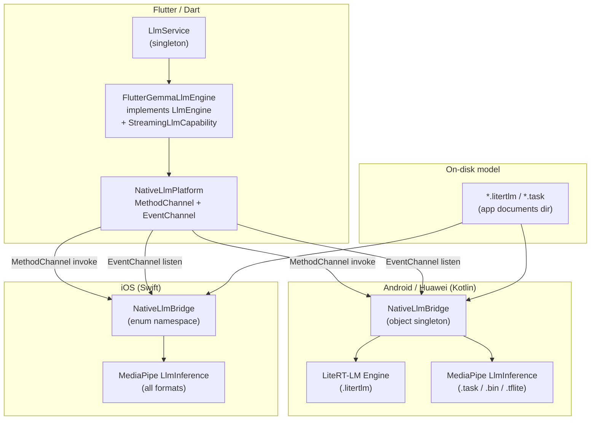

# Design Document: Native Inference Engine

## Overview

The native inference engine replaces any `flutter_gemma` pub package dependency with a fully in-tree, cross-platform implementation. The engine bridges Flutter/Dart to platform-native LLM runtimes via Flutter's MethodChannel and EventChannel APIs:

- **Android / Huawei**: `NativeLlmBridge.kt` (Kotlin singleton) — uses **LiteRT-LM** (`com.google.ai.edge.litertlm:litertlm-android`) for `.litertlm` bundles and **MediaPipe GenAI** (`com.google.mediapipe:tasks-genai`) for `.task`/`.bin`/`.tflite` files. Both libraries are GMS-free, making them compatible with Huawei HMS devices.
- **iOS**: `NativeLlmPlugin.swift` (Swift enum) — uses **MediaPipe GenAI** (`MediaPipeTasksGenAI` CocoaPod) for all model formats.

The Dart layer (`NativeLlmPlatform`, `FlutterGemmaLlmEngine`) is platform-agnostic and communicates exclusively through the two named channels.

---

## Architecture



### Channel Names

| Channel | Type | Purpose |
|---------|------|---------|
| `za.co.ikamvalam/native_llm` | MethodChannel | `loadModel`, `closeModel`, `generate` |
| `za.co.ikamvalam/native_llm_stream` | EventChannel | Streaming token generation |

### Threading Model

- **Android**: A single-thread `Executors.newSingleThreadExecutor()` runs all inference operations. Results are posted back to the main thread via `Handler(Looper.getMainLooper())`.
- **iOS**: `generate` dispatches to a `DispatchQueue.global(qos: .userInitiated)` background queue. Streaming uses Swift `Task(priority: .userInitiated)` with `@MainActor` for sink callbacks.
- **Dart**: All channel calls are `async`/`await`. `FlutterGemmaLlmEngine` uses a single-flight `Future` (`_ensureLoadedInFlight`) to deduplicate concurrent `ensureLoaded` calls.

---

## Components and Interfaces

### NativeLlmPlatform (Dart)

Static wrapper around the two channels. No state.

```dart
abstract final class NativeLlmPlatform {
  static const MethodChannel _method = MethodChannel('za.co.ikamvalam/native_llm');
  static const EventChannel _stream = EventChannel('za.co.ikamvalam/native_llm_stream');

  static Future<void> loadModel(Map<String, Object?> args);
  static Future<void> closeModel();
  static Future<String> generate(Map<String, Object?> args);
  static Stream<String> generateStream(Map<String, Object?> args);
}
```

`generateStream` maps the raw broadcast stream: Map events with `token` key yield the token string; Map events with `error` key throw `PlatformException`; plain String events are returned as-is.

### FlutterGemmaLlmEngine (Dart)

Implements `LlmEngine` and `StreamingLlmCapability`. Owns the install-and-open lifecycle.

Key responsibilities:
- **Install gate**: Checks `ModelCacheChecker.isCached` before downloading.
- **Open with retry**: Tries GPU first, falls back to CPU for non-multimodal models.
- **Single-flight load**: `_ensureLoadedInFlight` deduplicates concurrent callers.
- **Stop sequences**: Applied in Dart post-processing after native returns.
- **JSON extraction**: `LlmOutputFilters.takeThroughFirstBalancedJson` applied to one-shot results.

```dart
final class FlutterGemmaLlmEngine implements LlmEngine, StreamingLlmCapability {
  Future<void> ensureLoaded();
  Future<ModelBoundCompletion> generate(LlmGenerateRequest request);
  Stream<String> generateChunkStream(LlmGenerateRequest request);
  void dispose();
}
```

### NativeLlmBridge — Android/Huawei (Kotlin)

Kotlin `object` singleton registered in `MainActivity.configureFlutterEngine`.

```kotlin
object NativeLlmBridge {
    fun register(messenger: BinaryMessenger, context: Context)
    private fun handleLoad(context: Context, call: MethodCall)
    private fun generateSync(call: MethodCall): String
    private fun generateStream(arguments: Any?, sink: EventChannel.EventSink?)
    private fun closeAllEngines()
}
```

Runtime selection by file extension:
- `.litertlm` → `Engine` (LiteRT-LM) with `Conversation` API
- anything else → `LlmInference` (MediaPipe) with `LlmInferenceSession` API

### NativeLlmBridge — iOS (Swift)

Swift `enum` namespace registered in `AppDelegate.didInitializeImplicitFlutterEngine`.

```swift
enum NativeLlmBridge {
    static func register(registrar: FlutterPluginRegistrar)
    private static func loadModel(args: [String: Any]) throws
    private static func generateSync(args: [String: Any]) throws -> String
    static func generateStreamAsync(args: [String: Any], events: FlutterEventSink?) async throws
}
```

iOS always uses MediaPipe `LlmInference` + `LlmInference.Session`.

### LlmInstallUiHooks (Dart)

Mutable callback container attached to `FlutterGemmaLlmEngine`. Allows `LlmService.configure` to attach/detach progress UI without disposing an in-flight engine.

```dart
final class LlmInstallUiHooks {
  void Function(int installPercent)? onInstallProgress;
  void Function(String phase, String message, int? percent)? onLifecycle;
}
```

---

## Data Models

### MethodChannel Argument Schemas

**`loadModel` arguments:**

| Key | Dart type | Native type | Description |
|-----|-----------|-------------|-------------|
| `modelPath` | `String` | String | Absolute path to model file on disk |
| `maxTokens` | `int` | Int/Number | Context window size |
| `preferGpu` | `bool` | Bool | Use GPU backend if true |
| `supportImage` | `bool` | Bool | Enable vision modality |
| `supportAudio` | `bool` | Bool | Enable audio modality |
| `maxNumImages` | `int` | Int/Number | Max images for vision (0 = disabled) |

**`generate` / `generateStream` arguments:**

| Key | Dart type | Native type | Description |
|-----|-----------|-------------|-------------|
| `prompt` | `String` | String | Full prompt text |
| `temperature` | `double` | Float/Double | Sampling temperature |
| `topK` | `int` | Int | Top-K sampling |
| `topP` | `double` | Double | Top-P (nucleus) sampling |
| `randomSeed` | `int` | Int | RNG seed |
| `enableThinking` | `bool` | Bool | Enable thinking channel (LiteRT-LM only) |
| `maxNewTokens` | `int` | Int | Max tokens to generate |

### EventChannel Stream Events

| Event type | Meaning |
|-----------|---------|
| `String` | Token chunk (direct string) |
| `Map { "token": String }` | Token chunk (map form) |
| `Map { "error": String }` | Error — Dart throws `PlatformException` |
| `FlutterEndOfEventStream` (iOS) / `sink.endOfStream()` (Android) | Generation complete |

### Thinking Channel Format (LiteRT-LM)

When `enableThinking` is true and the LiteRT-LM response includes a `thought` channel:

```
<|channel>thought
{thinking content}
<channel|>{main response text}
```

This is prepended by the native bridge before returning to Dart.

### GPU/CPU Fallback Decision Tree

```
preferGpu = !lowRamProfile && !forceCpuBuildFlag
         OR (multimodal → always GPU)

open(preferGpu=true)
  ├─ success → done
  └─ failure
       ├─ multimodal → rethrow (no CPU fallback)
       └─ non-multimodal → open(preferGpu=false)
            ├─ success → done
            └─ failure → retry after 400ms delay
                 ├─ GPU exhaustion + non-multimodal → open(preferGpu=false)
                 └─ other → open(preferGpu=true again)
                      └─ failure → purge + reinstall + open
```

---

## Correctness Properties

*A property is a characteristic or behavior that should hold true across all valid executions of a system — essentially, a formal statement about what the system should do. Properties serve as the bridge between human-readable specifications and machine-verifiable correctness guarantees.*


### Property 1: loadModel configures runtime with exact flags

*For any* combination of `preferGpu`, `supportImage`, `supportAudio`, and `maxNumImages` values passed to `loadModel`, the native runtime SHALL be initialised with exactly those backend and modality settings (GPU vs CPU backend, vision modality enabled iff `supportImage && maxNumImages > 0`, audio modality enabled iff `supportAudio`).

**Validates: Requirements 2.1, 2.5, 2.6, 2.7**

### Property 2: loadModel with missing or invalid modelPath returns bad_args error

*For any* `loadModel` call where `modelPath` is absent, null, or not a String, the native bridge SHALL return an error with code `bad_args` and SHALL NOT initialise any runtime.

**Validates: Requirements 2.3**

### Property 3: Sequential loadModel calls close the previous runtime

*For any* sequence of two `loadModel` calls with different model paths, after the second call completes, only one runtime instance SHALL be active (the previous one is closed before the new one opens).

**Validates: Requirements 2.2**

### Property 4: generate returns a string for any valid loaded model

*For any* valid `generate` argument map (with `prompt`, `temperature`, `topK`, `topP`, `randomSeed`, `enableThinking`, `maxNewTokens`) when a model is loaded, the native bridge SHALL return a non-error String result.

**Validates: Requirements 3.1**

### Property 5: Thinking channel format is correct for LiteRT-LM responses

*For any* LiteRT-LM generation where the response includes a non-empty `thought` channel, the returned string SHALL start with `<|channel>thought\n` and contain `<channel|>` before the main response text.

**Validates: Requirements 3.5**

### Property 6: Streaming emits tokens then closes for any valid prompt

*For any* valid prompt and loaded model, the EventChannel stream SHALL emit one or more String tokens and then signal end-of-stream (no dangling open streams after generation completes).

**Validates: Requirements 4.1, 4.2**

### Property 7: closeModel makes generate fail with not-loaded error

*For any* model that has been successfully loaded, calling `closeModel` followed by `generate` SHALL result in an error with code `generate_failed` and a message indicating the model is not loaded.

**Validates: Requirements 5.1**

### Property 8: FlutterGemmaLlmEngine throws StateError after dispose

*For any* `FlutterGemmaLlmEngine` instance that has been disposed, calling `generate` or `generateChunkStream` SHALL throw a `StateError`.

**Validates: Requirements 5.4, 7.5**

### Property 9: GPU fallback succeeds for non-multimodal models

*For any* non-multimodal model where the GPU open attempt fails, `FlutterGemmaLlmEngine.ensureLoaded` SHALL successfully complete by falling back to the CPU backend (no exception propagated to the caller).

**Validates: Requirements 6.2**

### Property 10: Multimodal GPU failure propagates without CPU fallback

*For any* multimodal model (vision or audio enabled) where the GPU open attempt fails, `FlutterGemmaLlmEngine.ensureLoaded` SHALL propagate the error without attempting a CPU fallback.

**Validates: Requirements 6.3**

### Property 11: lowRamProfile forces CPU backend for non-multimodal models

*For any* non-multimodal model loaded when `SettingsStore.lowRamProfile` is `true`, `FlutterGemmaLlmEngine` SHALL pass `preferGpu: false` to `NativeLlmPlatform.loadModel`.

**Validates: Requirements 6.5**

### Property 12: ensureLoaded deduplicates concurrent calls

*For any* number of concurrent `ensureLoaded` calls on the same `FlutterGemmaLlmEngine` instance, the native `loadModel` channel method SHALL be invoked exactly once (single-flight deduplication).

**Validates: Requirements 7.4**

### Property 13: Stop sequences truncate response at first occurrence

*For any* response string and any non-empty stop sequence that appears within it, `FlutterGemmaLlmEngine._applyStopSequences` SHALL return the substring up to (but not including) the first occurrence of the stop sequence.

**Validates: Requirements 7.8**

### Property 14: Error classifiers correctly categorise known error strings

*For any* error string containing the documented GPU Metal delegate keywords, `gemmaErrorLooksLikeGpuMetalDelegateFailure` SHALL return `true`; *for any* string containing GPU resource exhaustion keywords, `gemmaErrorLooksLikeGpuResourceExhaustion` SHALL return `true`; *for any* string containing zip archive keywords (and not GPU Metal keywords), `gemmaErrorLooksLikeInvalidTaskArchive` SHALL return `true`; *for any* string containing none of these keywords, all three classifiers SHALL return `false`.

**Validates: Requirements 9.1, 9.2, 9.3**

### Property 15: shouldUseFlutterGemmaEngine returns true only on Android/iOS

*For any* platform, `shouldUseFlutterGemmaEngine` SHALL return `true` if and only if `Platform.isAndroid || Platform.isIOS` is `true` and `kIsWeb` is `false`. This covers Huawei devices since they satisfy `Platform.isAndroid`.

**Validates: Requirements 10.2, 11.4**

### Property 16: Dart argument map matches channel protocol schema

*For any* `LlmGenerateRequest`, the argument map produced by `FlutterGemmaLlmEngine._genArgs` SHALL contain exactly the keys `prompt`, `temperature`, `randomSeed`, `topK`, `topP`, `enableThinking`, and `maxNewTokens` with values of the correct types matching the channel protocol schema.

**Validates: Requirements 8.2**

---

## Error Handling

| Scenario | Detection | Response |
|----------|-----------|----------|
| Missing `modelPath` arg | `args["modelPath"]` is null/wrong type | Return `bad_args` error |
| Model file not found | `File(path).exists()` / `FileManager.fileExists` | Return `load_failed` error with path |
| GPU delegate failure (iOS Metal) | `gemmaErrorLooksLikeGpuMetalDelegateFailure` | Retry with CPU (non-multimodal) or propagate (multimodal) |
| GPU resource exhaustion | `gemmaErrorLooksLikeGpuResourceExhaustion` | Delay 400ms + retry; force CPU for non-multimodal |
| Corrupt archive (zip error) | `gemmaErrorLooksLikeInvalidTaskArchive` | Purge + reinstall; throw `LlmUnavailableException` with hint |
| Storage full during download | `enospc`/`space`/`storage` in message | Throw `LlmResourceException` |
| Network error (all retries exhausted) | `DetailedSmartDownloader` exhausted | Throw `LlmUnavailableException` |
| Generate with no model loaded | `loadedPath == null` / `inference == nil` | Return `generate_failed` error |
| Stream timeout (Android LiteRT-LM) | `CountDownLatch.await` returns false | Throw `IllegalStateException("LiteRT stream timed out")` |
| Stream timeout (Android MediaPipe) | `CountDownLatch.await` returns false | Throw `IllegalStateException("MediaPipe stream timed out")` |
| Engine disposed | `_disposed == true` | Throw `StateError` |
| `markPrepareDone` throws | Any exception in `_finishLoaded` | Log and continue (best-effort) |
| Huawei GPU driver incompatible | `load_failed` from native | `FlutterGemmaLlmEngine` falls back to CPU per Property 9 |

---

## Testing Strategy

### Dual Testing Approach

Both unit tests and property-based tests are required. Unit tests cover specific examples, edge cases, and error conditions. Property tests verify universal invariants across generated inputs.

### Unit Tests

Focus areas:
- `NativeLlmPlatform` channel method signatures (compile-time verification).
- `FlutterGemmaLlmEngine._genArgs` produces the correct argument map for representative `LlmGenerateRequest` values.
- `FlutterGemmaLlmEngine._applyStopSequences` with specific stop sequence examples.
- Error classification helpers with known error strings (GPU Metal, GPU exhaustion, invalid archive).
- `shouldUseFlutterGemmaEngine` returns correct values for mocked platform conditions.
- `FlutterGemmaLlmEngine` throws `StateError` after `dispose`.
- `FlutterGemmaLlmEngine` throws `LlmUnavailableException` on non-mobile platform.
- `GemmaHfModelDownloadService.isPluginModelInstalled` returns `false` on web.

### Property-Based Tests

The project uses `flutter_test`. Property tests are implemented as parameterised tests iterating over representative input sets, since the input space for most properties is enumerable or can be covered with a representative sample.

**Property test configuration:**
- Minimum 100 iterations per property test where inputs are generated (e.g., error string classification).
- For enum-based properties, all enum values are covered.
- For string-based properties (error classifiers), a set of ≥ 10 known strings per category is used.

**Tag format:** `// Feature: native-inference-engine, Property N: <property_text>`

Each correctness property is implemented by a single test or parameterised test group.

**Key property tests:**
- **Property 13** (stop sequences): Generate random response strings and random stop sequences; verify truncation is always at the first occurrence.
- **Property 14** (error classifiers): Iterate over known keyword sets; verify each classifier returns the correct boolean for all combinations.
- **Property 15** (`shouldUseFlutterGemmaEngine`): Test all platform combinations (Android, iOS, web, desktop).
- **Property 16** (argument map schema): Generate representative `LlmGenerateRequest` values; verify all required keys are present with correct types.

### Integration Tests

Integration tests (requiring a real device or emulator with a model file) are out of scope for automated CI but should be run manually before release:
- Load a real `.litertlm` model and verify `generate` returns a non-empty string.
- Load a real model and verify `generateStream` emits tokens and closes.
- Verify GPU→CPU fallback on a device where GPU fails.
- Verify Huawei device loads and generates correctly.
