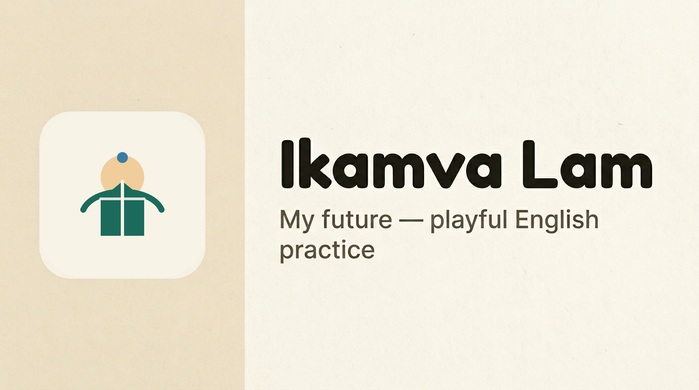

# Ikamva Lam



Playful, Teacher/Parent-guided English practice for primary and early secondary learners (school or home). Learner app targets **offline-first** use on tablets and low-end phones; on-device AI runs via native **LiteRT-LM / MediaPipe** channels with **Gemma 3n or Gemma 4** `.litertlm` weights downloaded once from Hugging Face (see [learner_app/docs/model_delivery.md](learner_app/docs/model_delivery.md)).

## Repository layout

| Path | Purpose |
|------|---------|
| [branding/](branding/) | Logo & cover PNGs (raster), SVG source, future brand assets |
| [scripts/](scripts/) | e.g. `generate_cover.py` — cover layout (logo + copy) |
| [learner_app/](learner_app/) | Flutter learner client |
| [learner_app/docs/model_delivery.md](learner_app/docs/model_delivery.md) | How Gemma 3n / Gemma 4 weights are downloaded & opened |
| [TASKS.md](TASKS.md) | Detailed build checklist |
| [design.md](design.md) | UX flows and visual tokens |
| [spec.md](spec.md) | Technical specification |
| [writeup.md](writeup.md) | Hackathon narrative |
| [docs/api_sync_contract.md](docs/api_sync_contract.md) | Optional summary sync API (TASKS §14) |
| [DEMO.md](DEMO.md) | 90s judging script (TASKS §16.1) |
| [teacher_web/](teacher_web/) | Teacher/Parent web dashboard placeholder (TASKS §14.3) |
| [notebooks/](notebooks/) | Kaggle-friendly overview notebook (TASKS §16.4) |

## Benchmarks & devices (TASKS §15.1–15.2)

Fill this table on real hardware after profiling. Stub LLM timings are not representative of Gemma.

| Metric | 4GB RAM (E2B target) | 8GB RAM (E4B target) |
|--------|----------------------|------------------------|
| Cold start → first interactive frame | TBD | TBD |
| Model ready (HF download + first `generate`) | TBD | TBD |
| First-token latency (one cloze prompt) | TBD | TBD |
| Avg. task generation (queue fill) | TBD | TBD |

**How to capture (TASKS Phase 17.1):** (1) Note device model, OS version, RAM, Git commit, and which **on-device variant** (Gemma 3n E2B/E4B or Gemma 4 E2B/E4B). (2) Cold start: time from app icon tap until Welcome or Hub is interactive. (3) Model ready: first successful `LlmService.generate` after setup download + hub warm-up finishes and the model is opened (Settings → “Warm up model” or first hub generation). (4) First-token: one representative `TASK: generate_cloze` prompt; stopwatch from invoke to first visible character if streaming is enabled, else full completion. (5) Queue fill: average wall time for `TaskQueueService` top-up of *N* items (pick N in app logs or debug panel). Paste numbers into this table and keep a copy for [writeup.md](writeup.md).

**Battery / thermal (TASKS §15.4):** run a continuous 15-minute practice session on a physical device; note % battery drop and subjective warmth in your writeup. No simulator substitute.

## Deploy demo (TASKS §14.4)

Build Flutter web or ship macOS build to judges. Example static hosting: **Firebase Hosting** or **GitHub Pages** — upload `build/web` after `flutter build web`, set SPA fallback to `index.html`, paste public URL into [writeup.md](writeup.md).

## Toolchain (pinned for the team)

- **Flutter:** 3.38.x stable (Dart 3.10+)
- **Platforms:** iOS, Android, macOS (desktop useful for local demos)

Run `flutter --version` in CI and locally; upgrade only when the team agrees.

## Run the learner app

```bash
cd learner_app
flutter pub get
flutter run
```

Target a tablet or resize the window to verify large touch targets and typography.

## Cover image (1200×630)

The welcome screen and docs use `branding/cover.png`: **logo** from `logo.png` on the **left** (same `#F6F1E7` as the logo canvas, ~one-third width), **title + tagline** on the **right** (cream panel, tight margins). Regenerate after logo changes:

```bash
python3 scripts/generate_cover.py
```

Requires **macOS** system fonts (*Arial Rounded Bold*, *Arial*). On Linux, point the script at equivalent `.ttf` paths or install those faces.

## Models (on-device Gemma 3n / Gemma 4)

- **Production (Android / iOS):** Download a **`.litertlm`** once from Hugging Face into app documents. Default recommendation: **Gemma 3n E2B** (multimodal-capable; needs `IKAMVA_HF_TOKEN`). **Gemma 4 E2B/E4B** from litert-community are public (no token) and suit the LiteRT prize track. Catalog + URLs: [`learner_app/docs/model_delivery.md`](learner_app/docs/model_delivery.md), [`gemma_model_config.dart`](learner_app/lib/llm/gemma_model_config.dart).
- **Setup gate:** First launch (after onboarding) opens **`/gemma-setup`** to choose and download; Settings → **Choose on-device model** to switch later.
- **Persistence:** weights stay under app documents. Cold starts re-open the active file; if missing or corrupt, **`LlmService.ensureReady` / `generate`** or the setup flow can re-download.
- **Cross-session correctness:** prepare state stores a **bundle fingerprint** (`network:<url>`). Switching variants invalidates prepare prefs and purges known filenames.
- **GPU crashes on mid-range Android:** use **Low RAM** in Settings or `--dart-define=IKAMVA_FORCE_CPU_BACKEND=1` (see [`gpu_timeout_fix.md`](learner_app/docs/gpu_timeout_fix.md)).
- **Stub / CI:** `IKAMVA_USE_STUB_LLM=1` or `flutter test` on a desktop host does not load the mobile plugin for real inference.
- **Privacy:** all **LLM inference is on-device**. Optional non-LLM network (e.g. sync) is separate—see `docs/api_sync_contract.md`.
- **Optional sync:** compile with `--dart-define=IKAMVA_SYNC_URL=https://example.com/v1/summaries` to exercise outbox flush (see `docs/api_sync_contract.md`).
- **Debug diagnostics:** in debug builds, `/dev/stats` is now tabbed (`Overview`, `Model`, `Event Log`). The `Event Log` captures verbose model lifecycle events (probe/open/install/retry/purge) and supports copy-to-clipboard for bug reports.

### VS Code, `.env`, and CI

- **Local:** VS Code **Run and Debug** may use **`--dart-define-from-file=${workspaceFolder}/.env`** (see **`.vscode/launch.json`**). For **Gemma 3n**, set **`IKAMVA_HF_TOKEN`** in that `.env`. Gemma 4 litert-community artifacts do not require a token.
- **Stub LLM (tests / forced QA):** set process environment **`IKAMVA_USE_STUB_LLM=1`** (not a `dart-define` in this codebase). Launch configs do not set it by default.
- **Release builds (GitHub Actions):** **`build-and-deploy`** creates an empty repo-root **`.env`** so **`--dart-define-from-file`** succeeds; bake **`IKAMVA_HF_TOKEN`** into CI secrets for Gemma 3n release smoke tests.

### Minimum device profile (on-device Gemma)

- **RAM:** target **≥ 4 GB** for E2B-class weights; enable **Low RAM** in Settings on weaker devices (smaller context, CPU preference). E4B wants stronger devices / more free storage.
- **OS:** **iOS 16+** (see `learner_app/ios/Podfile`); Android — recent 64-bit device/emulator compatible with LiteRT-LM / MediaPipe.
- **Below minimum:** model prepare or inference may fail; the app shows errors — there is **no** cloud LLM fallback.

### Local Models Setup (optional QA)

Weights are **not** bundled in `pubspec.yaml`. To sideload for QA, place a `.litertlm` under the app documents path with the expected filename (see `GemmaModelConfig`) or use the in-app download flow.
## License

This repository is licensed under [Creative Commons Attribution 4.0 International (CC BY 4.0)](https://creativecommons.org/licenses/by/4.0/). See [LICENSE](LICENSE). That matches the Gemma 4 Good Hackathon winner license type; third-party dependencies (for example Flutter packages) remain under their own licenses.

Use Gemma model weights only in line with [Google’s Gemma terms of use](https://ai.google.dev/gemma/terms) (separate from the Kaggle rules file).

```bash
flutter run -d 23106RN0DA --dart-define=IKAMVA_FORCE_CPU_BACKEND=1
```