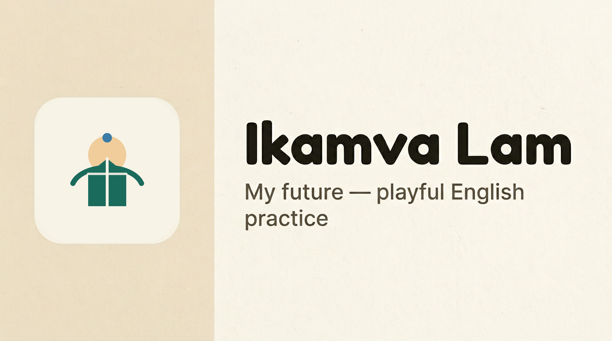
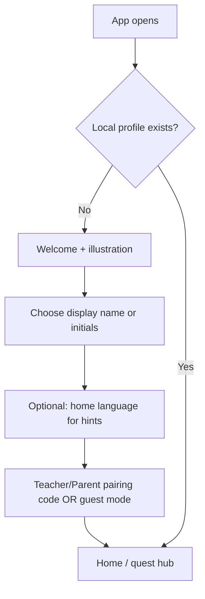
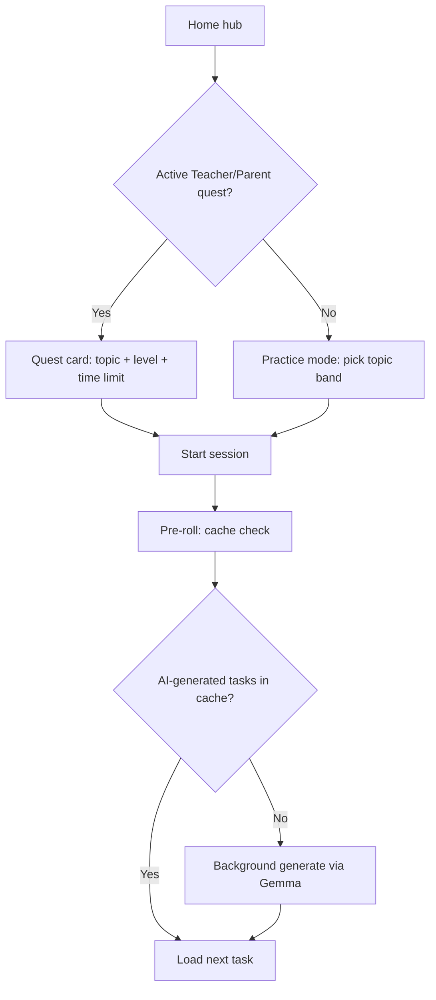
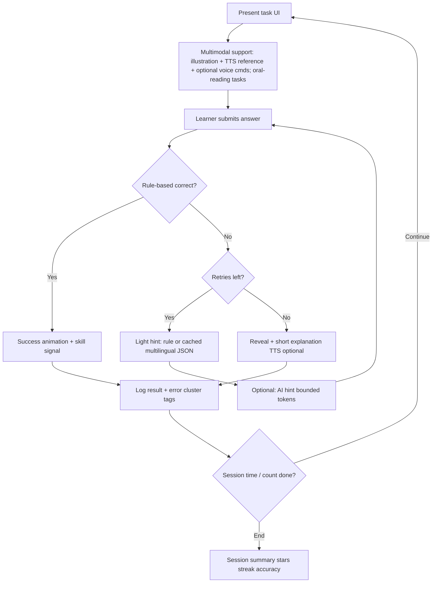
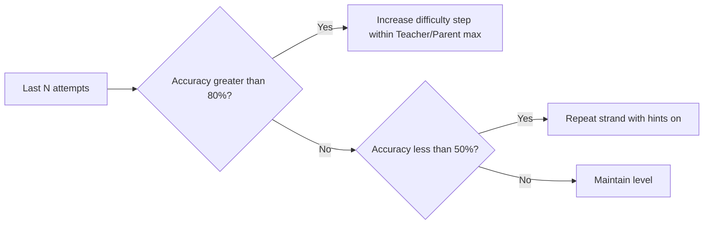
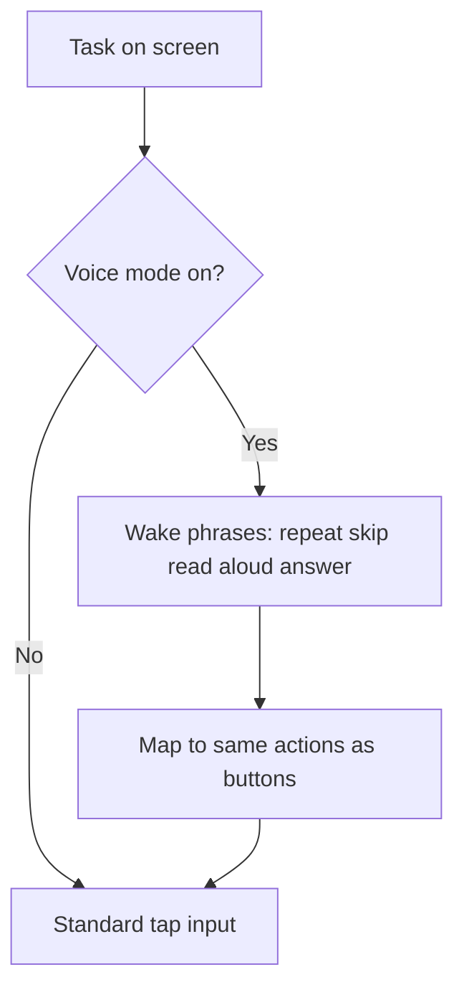
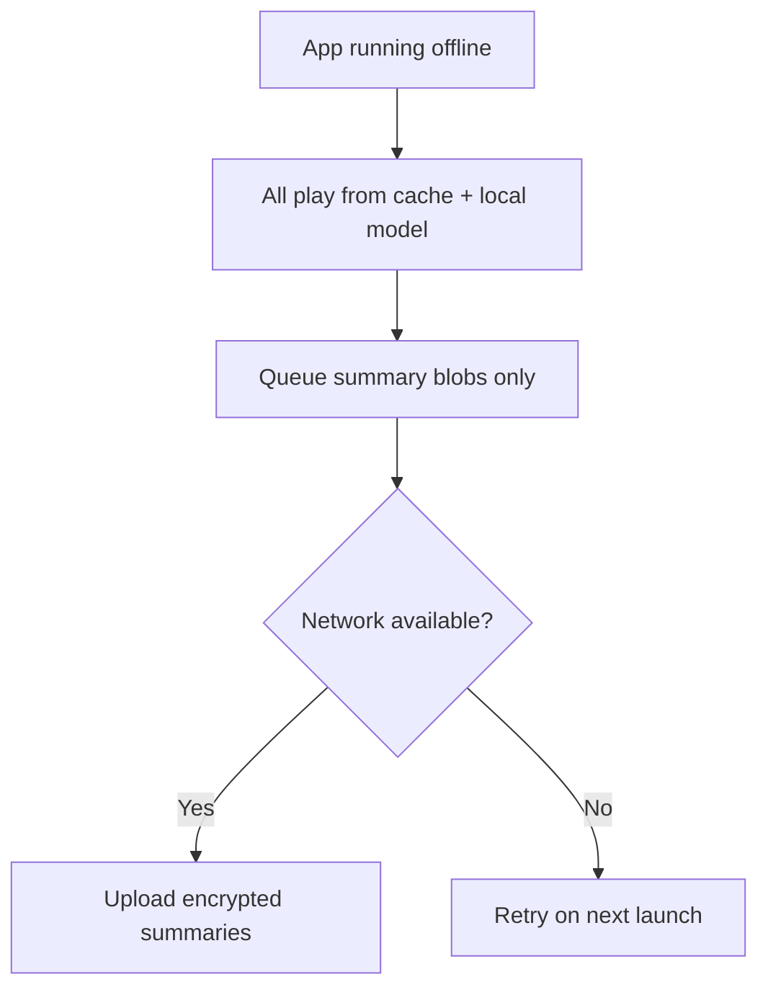
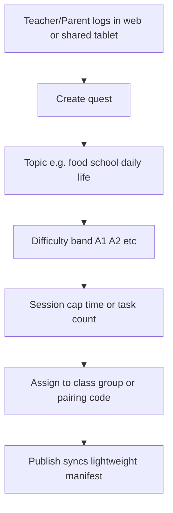
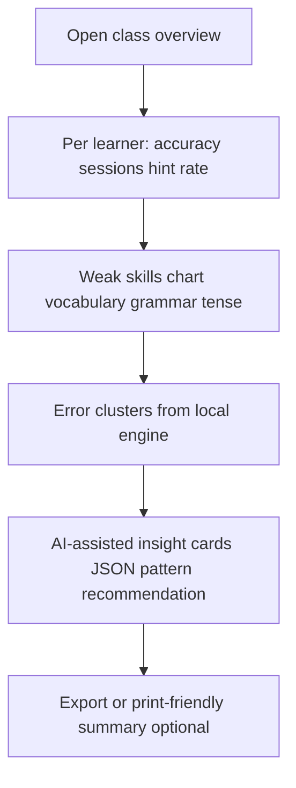

# Ikamva Lam — User Flows & Visual Design

 · [SVG source](branding/logo.svg)

This document translates [spec.md](spec.md) and [writeup.md](writeup.md) into concrete user journeys and a visual language suitable for Flutter on tablets and low-end laptops.

---

## 1. Actors & contexts

| Actor | Primary surface | Connectivity | Notes |
|--------|-----------------|--------------|--------|
| **Learner** | Flutter app (tablet / laptop) | Offline-first; sync when available | Multimodal: tap, read, listen, optional voice |
| **Teacher/Parent** | Web dashboard (optional) + in-app setup on shared or home device | Low bandwidth when syncing | School teacher or parent; sees summaries and insights, not raw chat |
| **System** | SQLite + llama.cpp + cache | N/A | Rule-based eval first; AI for generation & hints; **learner-facing questions are AI-generated** (cache holds prior model output, not static banks in production) |

---

## 2. Learner user flows

### 2.1 First launch & profile (minimal)

Keeps setup short so shared devices and low literacy are not blocked by long forms.

### 2.2 Session: pick up assigned work

*Cache entries are pre-generated model outputs; they are not a substitute for fixed offline question packs in production (see [spec.md §4.1.1](spec.md)).*

### 2.3 Core game loop (per task)

Aligned with spec §8: cache/generate → answer → rule eval → hint if needed → persist.

### 2.4 Adaptive difficulty (invisible to child, visible in analytics)

### 2.5 Voice command overlay (optional path)

### 2.6 Offline / sync edge cases

---

## 3. Teacher/Parent user flows

### 3.1 Configure a weekly quest

### 3.2 Review performance

---

## 4. Screen inventory (learner app)

| Screen | Purpose | Multimodal notes |
|--------|---------|------------------|
| Welcome / pairing | Low-friction entry | Large illustration, single primary CTA |
| Home / quest hub | Show assigned quest + streak | Cards, not dense lists |
| Game shell | Shared chrome for all micro-games | Progress, pause, accessibility |
| Cloze | Fill blank | Sentence + illustration; TTS reads stem |
| Reorder | Drag or tap-to-order | Short lines; haptic/light animation |
| Match | Vocabulary pairs | Large touch targets |
| Dialogue choice | Contextual comprehension | Character illustration optional |
| Read aloud | Speak displayed text | Large type; **Play reference** (TTS) then record or tap “I said it”; aligns with spec §4.1.2 |
| Pronunciation / intonation | Listen–compare–choose or produce | Minimal pairs, stress marks, or “say it like a question”; optional waveform or simple turn-taking UI |
| Oral reading check | Reading + speaking together | Short line shown; learner reads aloud; app may compare timing/stress heuristics or offer self-rubric |
| Hint sheet | Multilingual hints | `hint_en` / `hint_xh` etc.; optional audio |
| Session end | Celebrate + stats | Simple charts; Teacher/Parent-safe messaging |
| Settings | Language for hints, TTS on/off, voice mode | Plain language labels |

---

## 5. Visual design system

Design goals from the spec: **motion without melting low-end GPUs**, **illustration for meaning**, **voice as equal citizen to text**, **readability in bright classrooms**.

### 5.1 Brand idea

- **Name:** Ikamva Lam — *my future* → upward growth, dawn light, young people moving forward.
- **Logo (raster):** [branding/logo.png](branding/logo.png) — export for apps and docs. **Cover / social:** [branding/cover.png](branding/cover.png) — 1200×630: left panel + logo, right panel with title and lowercase tagline (see [scripts/generate_cover.py](scripts/generate_cover.py)). **Vector source:** [branding/logo.svg](branding/logo.svg) — square canvas (`#F6F1E7`), sun disc (`#E8A23E`), horizon arc and open book (`#1B6B5C`), accent dot (`#3A7CA5`).
- **Tone:** Warm, classroom-safe, playful but not infantile (primary through early secondary).
- **Avoid:** Generic “AI purple”, cluttered chat metaphors, tiny body text.

### 5.2 Color palette (tokens)

Use as Flutter `ThemeExtension` or constants. Favor **WCAG AA** contrast for text on surfaces.

| Token | Role | Suggested hex | Notes |
|-------|------|---------------|--------|
| `surface.canvas` | App background | `#F6F1E7` | Warm paper; reduces glare vs pure white |
| `surface.card` | Cards / modals | `#FFFFFF` | Slight radius 12–16dp |
| `primary` | Main actions | `#1B6B5C` | Deep teal-green; growth, calm focus |
| `primary.on` | Text on primary | `#FFFFFF` | |
| `accent.sun` | Highlights, streaks | `#E8A23E` | Sunrise / achievement |
| `accent.sky` | Secondary info | `#3A7CA5` | Links, metadata |
| `semantic.success` | Correct feedback | `#2F8F6B` | Pair with check animation |
| `semantic.warning` | Retry, gentle alert | `#C47A00` | Not harsh red for wrong first try |
| `semantic.error` | Hard fail / block | `#B3261E` | Sparingly |
| `text.primary` | Body | `#1C1B16` | |
| `text.secondary` | Captions | `#5C574C` | |

**Dark mode (optional later):** invert to `#121410` canvas, `#1E1E1E` cards, lighten primary to `#2D9D88` for contrast.

### 5.3 Typography

**Implementation lock (learner app):** `ThemeData` / `TextTheme` live in [`learner_app/lib/theme/app_theme.dart`](learner_app/lib/theme/app_theme.dart) and must use the [`google_fonts`](https://pub.dev/packages/google_fonts) helpers: **`GoogleFonts.nunito`** for display, app bar titles, and heading roles; **`GoogleFonts.sourceSans3`** for body text, buttons, and labels. Do not replace that with bundled `.ttf` files plus `fontFamily: '…'` in theme code unless this subsection and [spec.md §2.1](spec.md) are updated in the same change—otherwise typography drifts from what screens expect.

- **Display / headings:** **Nunito** (rounded, friendly, highly legible) — applied via `GoogleFonts.nunito` in code.
- **Body / tasks:** **Source Sans 3** — strong multilingual coverage (Latin + future expansion); applied via `GoogleFonts.sourceSans3` in code.
- **Sizes (tablet baseline):** body 18–20sp, task sentence 22–26sp, CTA label 16sp bold minimum.
- **Line length:** ≤ 12 words per line on cloze tasks where possible (matches spec short sentences).

### 5.4 Layout & touch

- **Minimum tap target:** 48dp; prefer 56dp for primary answers.
- **One focal column** on tablet; avoid side-by-side dense columns for reading tasks.
- **Safe areas** for notches; **bottom nav** for Home / Continue / Hint to avoid top reach on large tablets.

### 5.5 Illustration style

- **Flat or soft-vector** characters and scenes; consistent stroke weight.
- **Diverse** South African classroom and daily-life contexts (uniforms, taxis, food, family scenes) — align with Teacher/Parent-chosen topics.
- **Functional:** each illustration should **anchor meaning** for the sentence, not mere decoration.

### 5.6 Motion (performance rules)

- Prefer **CSS/Flutter implicit animations** under 200ms for feedback.
- **Stagger** list reveals only when item count < 8.
- **Disable heavy blur** on low-RAM profile; use solid shadows sparingly.
- **Success:** scale + sunburst or confetti-lite particle count capped.

### 5.7 Voice & accessibility

- **Always** pair spoken instructions with on-screen text where possible.
- **Subtitles** for TTS strings; **caption** length matches spec short outputs.
- **Reduce motion** OS flag: swap animations for color/state change only.
- **Pronunciation & read aloud:** offer a **clear reference utterance** (TTS) before the learner speaks; keep lines short; avoid dense phonetic symbols unless the level calls for it—prefer **listen → repeat → light feedback** over long explanations.
- **Intonation cues:** where the task is “say it like a question” or emphasis, use **layout** (punctuation visible), **optional pitch contour iconography**, or a **second TTS playback** as the target pattern—not open-ended chat.

---

## 6. Component patterns (Flutter-oriented)

| Pattern | Behavior |
|---------|----------|
| **Quest card** | Topic chip, level pill, time left, large “Start” |
| **Task header** | Skill icon + difficulty dots; progress bar for session |
| **Answer chips** | Cloze options as full-width chips; selected state high contrast |
| **Hint drawer** | Bottom sheet; tabs or segmented control for EN / isiXhosa / isiZulu / Afrikaans |
| **Voice FAB** | Optional; when on, shows mic state listening / processing |
| **Insight card (Teacher/Parent)** | Issue title, pattern subtitle, recommendation bullet |

---

## 7. Teacher/Parent dashboard (web) — visual alignment

- **Dense but scannable:** tables for class list; cards for AI insights.
- **Same primary/accent** as learner app for brand continuity.
- **Data-light charts:** bar for skill weakness, sparkline for sessions over week.
- **Privacy cue:** copy like “Summaries only — no chat logs” near header.

---

## 8. Mapping to competition tracks

| Track | How design supports it |
|-------|-------------------------|
| Main | Clear learner + Teacher/Parent loops in flows above |
| Future of education | Skill graph + adaptive flow tied to measurable session end stats; **oral reading & prosody** task surfaces in §4 |
| Digital equity | Offline paths, large type, multilingual hint UI, low-end motion rules |
| llama.cpp | No UI dependency on streaming; show optional “thinking…” only if needed; prefer pre-cached tasks |

---

## 9. Next steps for implementation

1. Flutter theme from §5 tokens + `ThemeExtension`.
2. Figma (optional):6 key frames — Welcome, Hub, Cloze, Hint drawer, Session end, Teacher/Parent insight card.
3. Asset pipeline: Lottie or Rive **only** if profiled on target 4–8GB devices; else sprite-based animation.

---

*Document version: 1.0 — aligned with spec.md & writeup.md. Learner app release **0.0.1** (`learner_app/pubspec.yaml`).*
