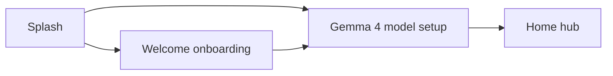

# Plan: Gemma 4 model selection before hub loading

This document describes how to align the main **learner_app** with **`learner_app/example`** (Flutter Gemma example): model choice **before** the home hub’s existing “model warm” loading phase, while restricting the catalog to **Gemma 4** variants only.

Implementation should follow this plan in a later change set; this file is the agreed design reference.

---

## 1. Goals

1. **Pre-hub model step** — After splash (and onboarding when applicable), the user completes **choose → optionally download → confirm** *before* navigating to `/home`, so `HomeHubBloc`’s `HomeHubLoadPhase.modelWarm` only runs for an **already chosen** install source (not as the first time the user hears about which weights exist).
2. **Match example patterns** — Reuse the same **flutter_gemma** primitives the example uses: `FlutterGemma.initialize` (already in `main.dart`), `FlutterGemma.installModel(…).fromNetwork(…).withProgress(…).install()` for downloads, and `fromAsset` / bundled path for local weights, plus existence checks like `FlutterGemma.isModelInstalled` where appropriate (see `learner_app/example/lib/services/model_download_service.dart`).
3. **Gemma 4 only** — The selection UI must not offer Gemma 3 or other families. The canonical catalog slice is the **Gemma 4** entries in `learner_app/example/lib/models/model.dart` (today: **E2B** and **E4B** `.litertlm` URLs, `ModelType.gemma4`, `ModelFileType.litertlm`).
4. **Keep the hub simple** — Home hub continues to call `LlmService.instance.ensureReady()`; it should not own copy for “which model URL” beyond what is already persisted in settings / install state.

---

## 2. Reference: how the example works

| Piece | Location | Relevance |
|--------|-----------|-----------|
| Plugin init | `example/lib/main.dart` | `FlutterGemma.initialize(…)` — we already do this in `learner_app/lib/main.dart` (with `maxDownloadRetries`). Optionally align `webStorageMode` if web is ever supported for Gemma; **today `shouldUseFlutterGemmaEngine` is false on web**, so native-only is fine. |
| Inference catalog | `example/lib/models/model.dart` | **Filter** to `modelType == ModelType.gemma4` only (E2B, E4B). Same URLs, filenames, and `PreferredBackend` defaults as the example for parity. |
| Selection list | `example/lib/model_selection_screen.dart` | Pattern: list cards → pick backend (CPU/GPU) where applicable → navigate to download or chat. We simplify: **no need for embedding path**; filters/sort can be minimal (e.g. fixed two cards) unless we want feature parity. |
| Download + progress | `example/lib/services/model_download_service.dart` | `checkModelExistence`, `downloadModel` with `withProgress` — lift a **small, dependency-light copy** into `learner_app/lib/llm/` (or `lib/features/ondevice_model/`) rather than depending on the example package. |
| Install from network | Same service | `FlutterGemma.installModel(modelType: …, fileType: …).fromNetwork(url, token: …, foreground: …).withProgress(…).install()` — Gemma 4 rows use **`ModelType.gemma4`** in the example (not `ModelType.gemmaIt`). |

---

## 3. Current app behavior (baseline)

- **Splash** → `/welcome` or `/home` (`learner_app/lib/router/app_router.dart`, `learner_app/lib/screens/splash_screen.dart`).
- **Home hub** immediately runs **`HomeHubStarted`** → `HomeHubLoadPhase.modelWarm` → `LlmService.instance.ensureReady()` (`home_hub_bloc.dart`).
- **`FlutterGemmaLlmEngine`** (`flutter_gemma_llm_engine.dart`) only installs from **`ModelPrepareConfig.bundledModelAssetPath`** (bundled `gemma-4-E2B-it.litertlm`) via `installBundledInferenceWeightsFromFlutterAsset`; if open fails, it purges and reinstalls from that asset.
- **`GemmaModelConfig`** documents Gemma 4 but sets `modelType` to **`ModelType.gemmaIt`** — this should be **reconciled with the example** (`ModelType.gemma4` for Gemma 4 installs) when implementing network install and plugin registration so behavior matches Hugging Face / LiteRT community artifacts.

---

## 4. Target navigation flow

**Rules:**

- **Onboarding first** — If `!settings.onboardingComplete`, keep existing redirect to `/welcome`. After welcome completes, send the user to **Gemma setup** (not straight to `/home`) on first run *or* whenever model choice is missing / invalid.
- **Gemma setup gate** — New route, e.g. `/ondevice-model` or `/gemma-setup`, shown when:
  - User finished onboarding (or skipped welcome path is not used), **and**
  - `shouldUseFlutterGemmaEngine` is **true** (Android/iOS), **and**
  - No valid persisted **“Gemma 4 variant + install state”** yet, **or** user explicitly opens “Change model” from Settings later.
- **Desktop / web** — When `shouldUseFlutterGemmaEngine` is false, **skip** this screen and go to `/home` (current non-Gemma behavior unchanged).

**Splash adjustment** — Instead of `context.go('/home')` only, resolve: onboarding → then Gemma gate → then `/home`. Same for any other entry that today jumps straight to `/home` after onboarding.

---

## 5. Catalog: Gemma 4 only (concrete options)

Mirror **`gemma4_E2B`** and **`gemma4_E4B`** from the example (`model.dart`):

| Variant | Source | Notes |
|---------|--------|--------|
| **Gemma 4 E2B IT** | Prefer **bundled asset** (current `assets/models/gemma-4-E2B-it.litertlm`) to avoid redundant download and match “simple” UX; optional second row “download E2B from network” only if we need parity with example for debugging — **default plan: one E2B path = bundled only**. |
| **Gemma 4 E4B IT** | **Network** install using example URL + filename (`gemma-4-E4B-it.litertlm`), `ModelType.gemma4`, `ModelFileType.litertlm`, `needsAuth: false`. |

This gives two real choices: **smaller bundled E2B** vs **larger downloaded E4B**, both Gemma 4.

If a future Gemma 4 artifact is added to the example enum, add it here **only** if `modelType` remains Gemma 4.

---

## 6. Persistence & config plumbing

**`SettingsStore`** (`settings_store.dart`) — add fields such as:

- `selectedGemma4VariantId` (enum or string key: `e2b_bundled` | `e4b_network`, etc.)
- Optionally `preferredOnDeviceBackend` if we expose CPU/GPU override beyond **Low RAM** (example uses `PreferredBackend`; we already map low RAM → CPU in the engine)

**`ModelPrepareConfig` / `GemmaModelConfig`** — evolve from a single bundled path to:

- **`activeModelType`** → `ModelType.gemma4` for all Gemma 4 installs (verify against plugin).
- **`activeFileType`** → `ModelFileType.litertlm`.
- **`modelInstallFingerprint`** — include variant id + source (`bundle:…` vs `network:…url…`) so `ModelPreparePrefs.shouldPrepareForCurrentConfig()` invalidates when the user switches models.
- **`bundledModelAssetPath`** — remains for E2B bundled branch only.

**`ModelPreparePrefs`** — continue using fingerprint equality; ensure **`markPrepareDoneForCurrentConfig`** writes the **new** fingerprint when variant changes.

**`purgeGemmaPluginInstallCandidates`** — extend uninstall ids to cover **E4B filename** and any network-derived ids so switching models does not leave a stale active install.

---

## 7. `FlutterGemmaLlmEngine` changes (high level)

1. **`ensureLoaded`** — Branch on persisted variant:
   - **E2B bundled** — Keep current `fromAsset` install path when active model missing or corrupt.
   - **E4B (network)** — Do **not** require the E2B asset in the asset manifest for that variant; if `isModelInstalled` / open fails, run **network install** (or send user back to setup screen if no network — product decision: prefer clear error on hub vs block at setup; **plan: complete download on setup screen** so hub only opens).
2. **Install progress** — Wire `onInstallProgress` / lifecycle to the same callbacks `LlmService` already supports so the hub loading UI can still show progress **after** choice (optional: if download finishes on setup screen, hub warm may be quick).
3. **Active model** — After install, `FlutterGemma.getActiveModel` must target the **registered** model for that filename / plugin id (same as example chat flow).

---

## 8. UI scope (keep it simple)

- **One screen** (or two short steps: list → download) styled like the app (Ikamva theme), not necessarily the example’s dark blue scaffold — **behavior** matches example, not pixel-perfect clone.
- **List** — Two cards: **Gemma 4 E2B (included)** and **Gemma 4 E4B (download ~4.3 GB)** with size and short copy.
- **E4B path** — After selection, show **download** UI patterned on `UniversalDownloadScreen` / `ModelDownloadScreen`: progress bar, optional HF token if ever needed (Gemma 4 example rows use `needsAuth: false`), **Continue** only when `checkModelExistence` is true.
- **Backend** — Respect `SettingsStore.lowRamProfile` → CPU; otherwise default GPU with same iOS GPU fallback already in `_openActiveModel`.

**Settings** — Add “On-device model” → navigate to same setup route so users can switch (with warning that switching may re-download or reinstall).

---

## 9. Routing & redirects (`app_router.dart`)

- Register **`/gemma-setup`** (name TBD) with `GoRoute`.
- **`redirect`** closure:
  - If onboarding incomplete → `/welcome` (unchanged).
  - Else if `shouldUseFlutterGemmaEngine` && !modelSetupComplete → `/gemma-setup`.
  - Else if onboarding done && on `/welcome` → `/home` **or** `/gemma-setup` per above (avoid landing on home before setup).
- **`SplashScreen._goNext`** — Use `goRouter` redirect target or explicit `go` to the next resolved route so we don’t bypass the gate.

---

## 10. Testing & verification

- **Unit / widget tests** — Mock `FlutterGemma` where tests already skip real engine (`llm_service_test.dart` pattern).
- **Device QA** — First install: E2B bundled opens without download; E4B downloads once; switch model clears old fingerprint and reinstall path works.
- **Regression** — `probeFlutterGemmaActiveModelReady` and cold start still valid when prefs say prepared but plugin empty.

---

## 11. Implementation order (suggested)

1. Add **variant enum + `SettingsStore` persistence** + **`ModelPrepareConfig` fingerprint** updates.
2. Extract or implement **`Gemma4ModelDownloadService`** (from example service, trimmed).
3. Add **`/gemma-setup` UI** + router/splash/welcome wiring.
4. Refactor **`FlutterGemmaLlmEngine.ensureLoaded`** for variant branches + purge ids.
5. Settings entry + copy polish.
6. Fix **`ModelType`** for Gemma 4 to match example/plugin and run on-device smoke tests.

---

## 12. Out of scope (for this plan)

- Embedding models / RAG (`EmbeddingModelsScreen` in example).
- Non–Gemma 4 models.
- Web/desktop Gemma (guarded by `shouldUseFlutterGemmaEngine`).

This plan intentionally mirrors **`learner_app/example`** so downloads, initialization, and `getActiveModel` usage stay boring and reliable, with a **narrower** catalog and a **fixed place in navigation** before the home hub loading experience.
