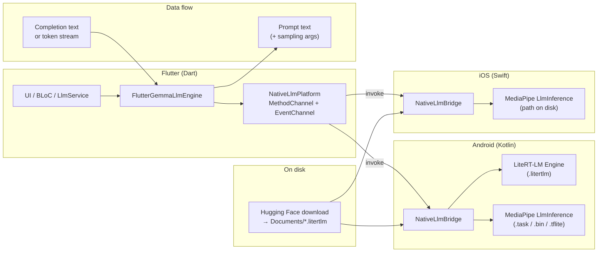

# Native on-device LLM: prompts and outputs

Architecture for **MethodChannel / EventChannel** inference after the `.litertlm` file is downloaded to app documents.

## Inputs (prompt path)

- **`loadModel`:** absolute `modelPath`, `maxTokens`, `preferGpu`, multimodal flags (`supportImage`, `supportAudio`, `maxNumImages`).
- **`generate` / stream:** `prompt` (user text), `temperature`, `topK`, `topP`, `randomSeed`, `enableThinking`, optional `maxNewTokens`.

## Outputs

- **`generate`:** single completion string (then Dart applies stop sequences and JSON helpers).
- **`generateStream`:** sequence of token/chunk strings via EventChannel until end of stream.
